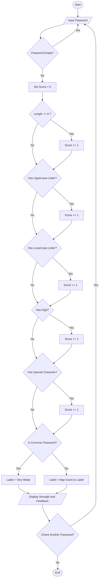
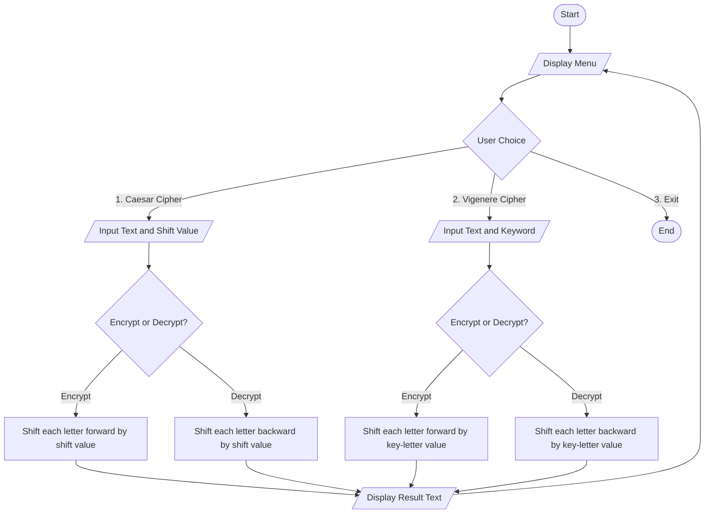

# Python Mini Projects — String Manipulation & User-Defined Functions


Two beginner-friendly Python console applications built to practice **string manipulation** and **user-defined functions**.

| # | Project | Core Concept |
|---|---------|---------------|
| 1 | [Password Strength Checker](#1-password-strength-checker) | String Manipulation Functions |
| 2 | [Text Encryption and Decryption Tool](#2-text-encryption-and-decryption-tool) | Strings, User-Defined Functions |

---

## Repository Structure

```
├── password_strength_checker.py
├── text_encryption_decryption.py
└── README.md
```

## Requirements

- Python 3.6 or above
- No external/third-party libraries needed — only Python's built-in string operations are used

## How to Run

```bash
python password_strength_checker.py
python text_encryption_decryption.py
```

---

## 1. Password Strength Checker

### Description

Checks how strong a password is by examining it character-by-character using **string manipulation functions** — no external libraries or regex involved. The password is scored out of 5 based on five criteria, mapped to a strength label, and returned with detailed pass/fail feedback for each rule.

### Flowchart



### Algorithm

1. **Start**
2. Prompt the user to input a password.
3. If the input is empty, display an error and return to Step 2.
4. Initialize `score = 0`.
5. Check length: if `len(password) >= 8`, increment `score` by 1.
6. Check for at least one uppercase letter using `isupper()`; if present, increment `score`.
7. Check for at least one lowercase letter using `islower()`; if present, increment `score`.
8. Check for at least one digit using `isdigit()`; if present, increment `score`.
9. Check for at least one special character (from a predefined set) using the `in` operator; if present, increment `score`.
10. Compare the password, converted to lowercase, against a list of common weak passwords.
11. Assign a strength label:
    - If it matches a common password → `Very Weak (Common Password)`
    - Otherwise map the score → `0–1: Very Weak`, `2: Weak`, `3: Moderate`, `4: Strong`, `5: Very Strong`
12. Display the strength label, the numeric score (`X/5`), and a checklist (OK/X) showing which criteria were met.
13. Ask the user whether they want to check another password.
14. If yes, repeat from Step 2; otherwise terminate the loop.
15. **Stop**

### Features

- Pure string manipulation — no `re` module used
- Score-based strength rating out of 5
- Checks the password against a list of common weak passwords
- Detailed OK/X feedback showing exactly which rule is missing
- Keeps running until the user types `exit`

### Sample Output

```
Enter a password to check (or 'exit' to quit): P@ssw0rd123

Password Strength: Very Strong  (Score: 5/5)

----- Detailed Feedback -----
[OK] At least 8 characters long
[OK] Contains an uppercase letter (A-Z)
[OK] Contains a lowercase letter (a-z)
[OK] Contains a digit (0-9)
[OK] Contains a special character (!@#$ etc.)
```

---

## 2. Text Encryption and Decryption Tool

### Description

A menu-driven console tool that encrypts and decrypts text using two classic substitution ciphers — the **Caesar Cipher** and the **Vigenère Cipher** — built entirely with **user-defined functions** and Python's character-code operations (`ord()`, `chr()`).

### Flowchart



### Algorithm

**A. Caesar Cipher**

1. **Start**
2. Display the menu and read the user's choice.
3. If choice = Caesar Cipher, read the input text and an integer shift value.
4. Ask whether to Encrypt or Decrypt.
5. For **Encryption**, process every character of the text:
   - If it is an uppercase letter, shift it within `A–Z` using `(ord(char) - ord('A') + shift) % 26 + ord('A')`.
   - If it is a lowercase letter, apply the same formula within `a–z`.
   - If it is not a letter (space, digit, punctuation), copy it unchanged.
6. For **Decryption**, repeat Step 5 using `-shift` in place of `shift` (this shifts every letter backward).
7. Display the resulting text.
8. Return to the menu (Step 2), and repeat until the user selects Exit.

**B. Vigenère Cipher**

1. **Start**
2. Display the menu and read the user's choice.
3. If choice = Vigenère Cipher, read the input text and an alphabetic keyword.
4. Ask whether to Encrypt or Decrypt.
5. For **Encryption**, maintain a `key_index` starting at 0. For every character of the text:
   - If it is alphabetic, compute `shift = ord(key[key_index % len(key)]) - ord('A')`, shift the character forward by `shift` positions (wrapping with `% 26`, preserving its case), then increment `key_index`.
   - If it is not alphabetic, copy it unchanged and **do not** increment `key_index`.
6. For **Decryption**, repeat Step 5 but shift each character backward by `shift` instead of forward.
7. Display the resulting text.
8. Return to the menu (Step 2), and repeat until the user selects Exit.
9. **Stop**

### Features

- Two independent cipher techniques in a single tool
- Case-preserving encryption and decryption
- Non-alphabetic characters (spaces, digits, punctuation) pass through unchanged
- Input validation for the shift value and the keyword
- Menu-driven loop until the user chooses Exit

### Sample Output

```
1. Caesar Cipher
2. Vigenere Cipher
3. Exit
Choose an option (1/2/3): 1
Enter the text: Hello World
Enter shift value (integer): 3
Encrypt or Decrypt? (E/D): E
Encrypted Text: Khoor Zruog
```

```
Choose an option (1/2/3): 2
Enter the text: Attack at Dawn
Enter keyword (letters only): LEMON
Encrypt or Decrypt? (E/D): E
Encrypted Text: Lxfopv ef Rnhr
```

---

## Concepts Practiced

- String indexing, iteration, and built-in methods (`isupper`, `islower`, `isdigit`, `isalpha`, `lower`, `upper`, `strip`)
- ASCII/character-code manipulation using `ord()` and `chr()`
- User-defined functions and modular program design
- Conditional logic and `while` loops
- Basic input validation using `try`/`except`

## Future Enhancements

- Add a strong-password generator/suggestion feature
- Support encrypting/decrypting whole text files
- Add a Tkinter-based GUI
- Add more ciphers (Atbash, Rail Fence, etc.)

## Author

[SHRIJIT MUKHERJEE](https://github.com/INSANE0PAPA)
